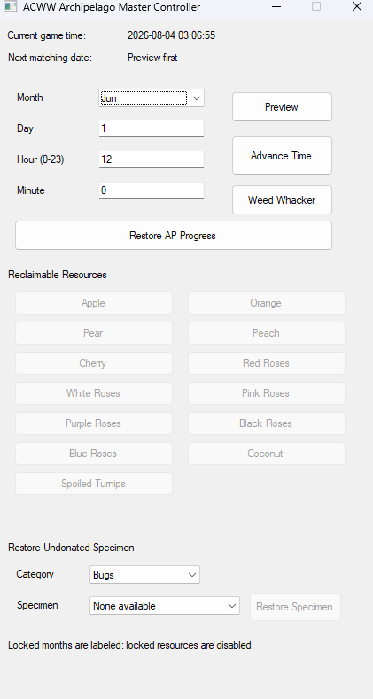

# Animal Crossing: Wild World Archipelago

Animal Crossing: Wild World Archipelago is an Archipelago Multiworld implementation for the Nintendo DS classic. Catch bugs and fish, complete the museum, unlock new months, and cooperate with players across other games to reach your goal.

This world transforms Animal Crossing: Wild World into a progression-based randomizer where museum donations, journal completion, and seasonal progression become checks that send items to players throughout the multiworld.

> ⚠️ This project is currently in **Alpha**. Bugs, balance changes, and compatibility improvements should be expected.

## Features

- **Catchsanity** – Catch unique bugs and fish to earn Archipelago checks.
- **Museumsanity** – Donate museum specimens for additional checks.
- **Journal Milestones** – Unlock checks for reaching unique catch milestones.
- **Museum Percentage Goals** – Progress through the museum to unlock additional rewards.
- **Month Progression** – Receive new months from other players to unlock seasonal creatures.
- **Fossil Exhibit Completion** – Complete fossil exhibits for bonus progression.
- **Master Controller** – Built-in BizHawk controller for time travel, recovery tools, and quality-of-life features.
- **Restore AP Progress** – Restore journal and museum completion after loading an older save or save state.
- **Specimen Recovery** – Recover undonated museum specimens lost due to crashes or loading old saves.
- **PopTracker Support** – Fully supported tracker pack.

## Goals

The primary objective is to complete a configurable percentage of the museum. During world generation, players can choose different completion percentages to create shorter or longer playthroughs depending on the size of the multiworld and their preferred experience.

## Installation

A complete installation guide can be found in:

docs/setup_en.md

The guide covers:

- Installing the ACWW world
- Installing the Lua connector
- BizHawk setup
- ROM validation
- PopTracker installation
- Connecting to an Archipelago server

## Supported ROM

Current supported version:

Animal Crossing: Wild World (USA) (Rev 1)

Game Code:
ADME

Revision:
1

SHA-1:
77FDE3E30E1E6068395D1F96EA63BE569B61C351

Support for additional revisions and regions is planned in future releases.

## Options

The world contains numerous customization options including:

- Catchsanity
- Museumsanity
- Journal Milestones
- Museum Percentage Goals
- Starting Month
- Goal Percentage
- High-RNG Catch Progression Exclusion

High-RNG Catch Progression Exclusion prevents extremely rare catches from becoming progression checks while still allowing their museum donations to remain progression, reducing the likelihood that important progression items become locked behind particularly rare catches.

## Checks

Checks can be earned from many different activities including:

- Catching unique bugs
- Catching unique fish
- Donating museum specimens
- Completing journal milestones
- Completing fossil exhibits
- Reaching museum completion percentages

This provides a steady stream of checks throughout the playthrough while encouraging players to experience the game's collection mechanics.

## Master Controller

The included BizHawk Master Controller provides several quality-of-life features for Archipelago gameplay. The controller was designed specifically for Animal Crossing gameplay, reducing repetitive tasks while providing recovery tools for save-state or crash scenarios.

Features include:

- Time travel to any unlocked month
- Preview upcoming dates
- Automatic weed removal
- Restore AP Progress
- Restore lost museum specimens
- Reclaim environmental resources such as fruit and flowers

The controller updates automatically while connected without interrupting gameplay.

## PopTracker

A PopTracker package is included with every release.

Features:

- Live location tracking
- Journal progress
- Museum progress
- Goal progress
- Seasonal availability
- Remaining checks

## Known Issues

- Only the USA Rev 1 ROM is currently supported.
- The Lua connector must currently be launched manually.
- This is an alpha release and bugs should be expected.

## Roadmap

Upcoming work includes:

- Additional ROM revision support
- Alternate goals
- NPC-based checks
- Trap items
- Additional quality-of-life improvements

For the complete roadmap, see ROADMAP.md.

## Credits

### Development

Mike Fritz

### Inspiration

After discovering Archipelago through Dark Souls Remastered, I quickly fell in love with the cooperative multiworld experience. Animal Crossing: Wild World was one of my favorite games growing up, and I wanted to experience it again through the unique progression and teamwork that Archipelago provides.

When I realized there wasn't an Archipelago implementation for any game in the Animal Crossing series, I decided to learn how Archipelago worlds are developed and build one myself.

This project would not have been possible without the Archipelago community, whose documentation, existing worlds, and willingness to answer questions made learning the framework possible.

## Disclaimer

Animal Crossing: Wild World is © Nintendo.

This project is an unofficial Archipelago implementation and is not affiliated with or endorsed by Nintendo. No game assets or ROMs are distributed with this project.
