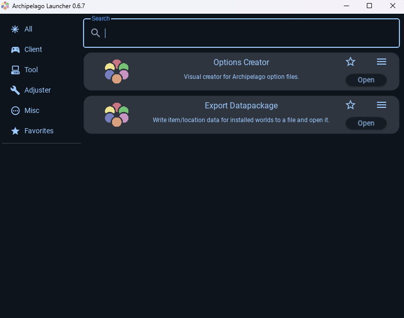
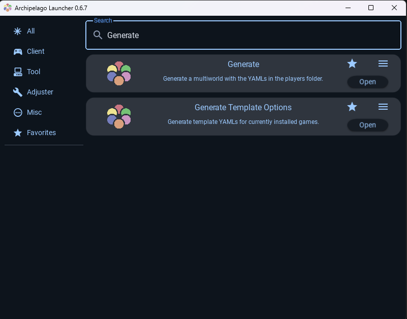
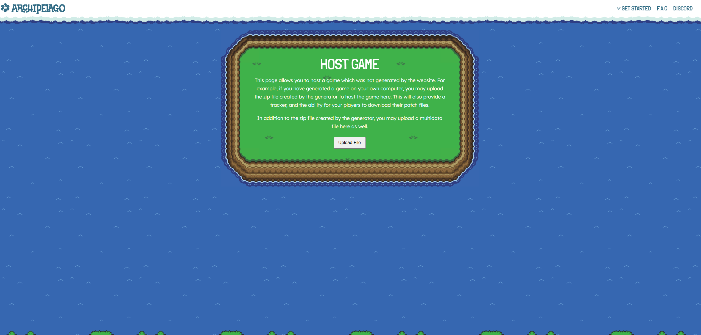
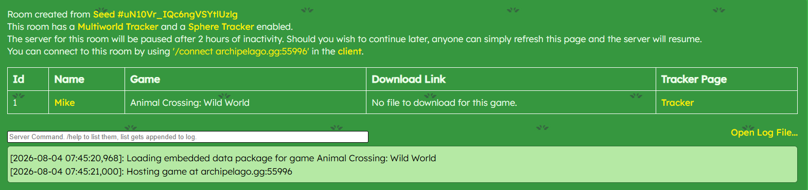
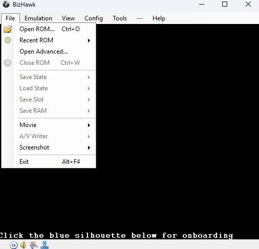
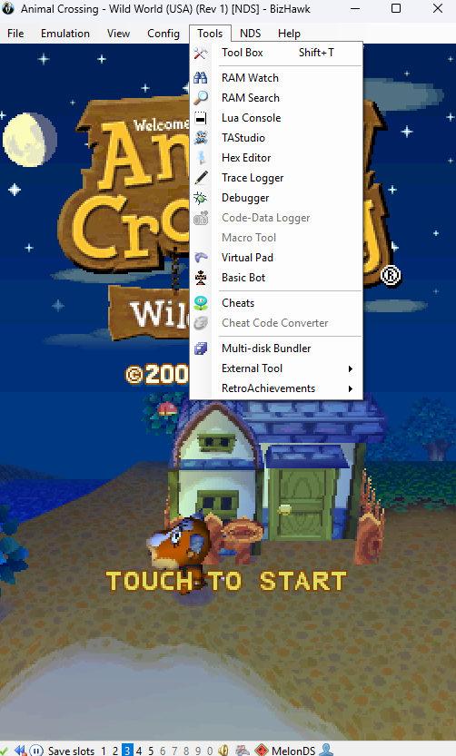
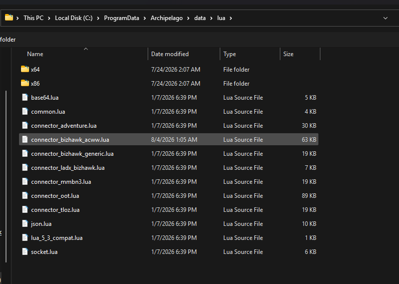
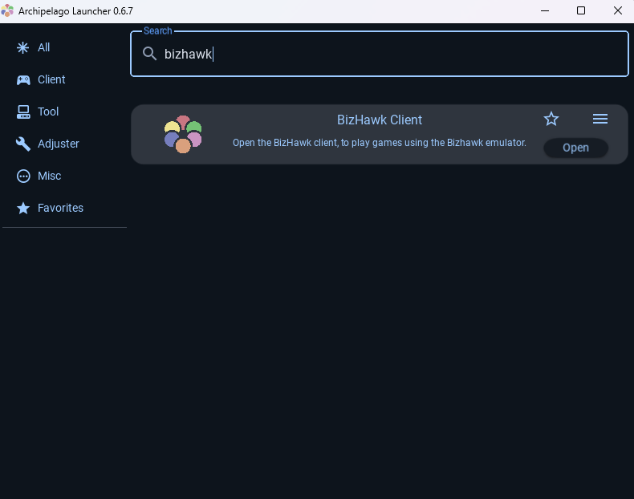

# Animal Crossing: Wild World Setup Guide

## Requirements

- Archipelago Launcher 0.6.7 or newer
- BizHawk Emulator 2.11.1
- A legally acquired Animal Crossing: Wild World ROM of US version ADME Rev 1. (Support for other ACWW versions to be implemented in future releases)
- ACWW BizHawk Connector lua script placed in your Archipelago/data/lua folder

## Downloads

- acww.apworld
- connector_bizhawk_acww.lua
- acww_poptracker.zip (Optional)

## Installing the World

- Download the latest acww.apworld from the Releases page.
- Double left-click the file to install to Archipelago/custom_worlds, or place acww.apworld manually in Archipelago/custom_worlds.
- Download the latest connector_bizhawk_acww.lua from the Releases page and place it in the Archipelago/data/lua folder.

## Creating a YAML

 
- In the Archipelago Launcher, navigate to the "Options Creator" and click "Open"
- Select "Animal Crossing: Wild World" in the left side bar.
- Enter the player name that will be used in the Archipelago session.
- Select the options desired via toggles and dropdown menus.
- When ready, click "Export Options" in the top right.
- Save your YAML in the Archipelago/Players folder.
- If someone else is hosting the game, send this YAML file to the game host.

## Generating a Seed

- With all YAMLs for the intended game are in the Archipelago/Players folder, navigate to the Archipelago folder and find the "host.yaml" file.
- Ensure the Players: value in host.yaml matches the number of YAML files in your Players folder.
 
- In the Archipelago Launcher, navigate to find the "Generate" option and click "Open"
- After the prompt completes, a .zip file will be installed to your Archipelago/output folder.
 
- On Archipelago.gg/uploads, upload the .zip file from your Archipelago/output folder.
- Create New Room for this seed.
 
- This Room page contains the /connect archipelago.gg:XXXXX where the XXXXX is your port for connecting to the multiworld game.
- Copy the archipelago.gg:XXXXX for pasting later, or manually type it in later.

## Launching the Game

- Open EmuHawk.exe to launc the BizHawk emulator.
  
- Under "File," select "Open ROM" 
- Select your Animal Crossing: Wild World NDS file.
- Wait at the game's title screen before starting a new game.

## Connecting the Lua Connector

  
- In the emulator's header, under "Tools" select Lua Console. 
- Select "Open Script" and select the connector_bizhawk_acww.lua file in the Archipelago/data/lua file path. 
- With the lua script running, it will say it is "Looking for client..."
- Keep the Lua Console open while playing. Closing it will disconnect the connector.

## Connecting to Archipelago

 
- In the Archipelago Launcher, navigate and oepn the "Bizhawk Client"
- At the top of the client, enter the server port (the archipelago.gg:XXXXX) that was generated for the seed and click "Connect"
- In the command line, enter your slot name exactly as it appears in the generated multiworld.
- The lua console should say "Client connected" and can be minimized (DO NOT CLOSE).
- The ACWW Archipelago Master Controller should open up and an in-game overlay should appear at the top of the in-game screen.
- When ready to start, select "New Game." If a save is already established, select "Other things" at the main menu and rebuild the town (this will remove your previous save, so create a backup if desired).

## First-Time Setup

- During the opening cutscene, Animal Crossing: Wild World initializes the in-game date using the system clock.
- Once player gains control outside the town hall, players must use the Master Controller to switch to one of their currently unlocked months before beginning normal gameplay to avoid accessing out-of-logic seasonal checks.

## PopTracker (Optional)

- Download the acww_poptracker.zip and place it in the poptracker/packs folder.
- Open PopTracker, load pack, and select Animal Crossing: Wild World. (Restart PopTracker after installing a new tracker pack if it does not appear)
- Connect the tracker to Archipelago by clicking the grayed out "AP" button in the top left.
- When prompted, enter the Archipelago host and port, slot name, and password (if required).
- If "AP" turns green, you are ready to go.
- If "AP" turns red, it is not connected. Verify the Archipelago host, port, slot name, and passwords were entered correctly.

## Troubleshooting

### The BizHawk Client says "Waiting to connect to BizHawk..."

Ensure:
- BizHawk is running.
- The correct ROM is loaded.
- The Lua connector is running.

### The Lua console says "Looking for client"

Open the Generic BizHawk Client from the Archipelago Launcher, connect to your server, and enter the slot name.

### I can't receive items

- Verify the supported ROM is being used.
- Verify the Lua console remains open.
- Verify the BizHawk Client is connected.
